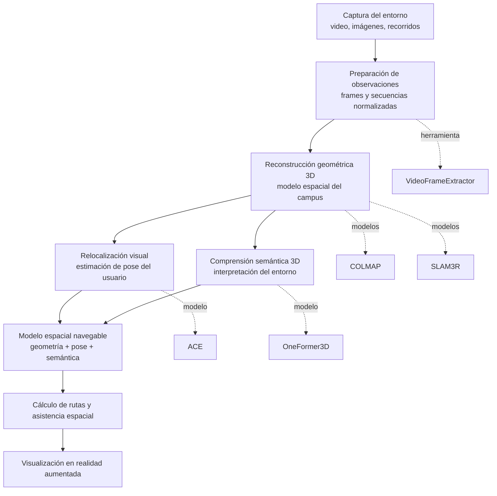
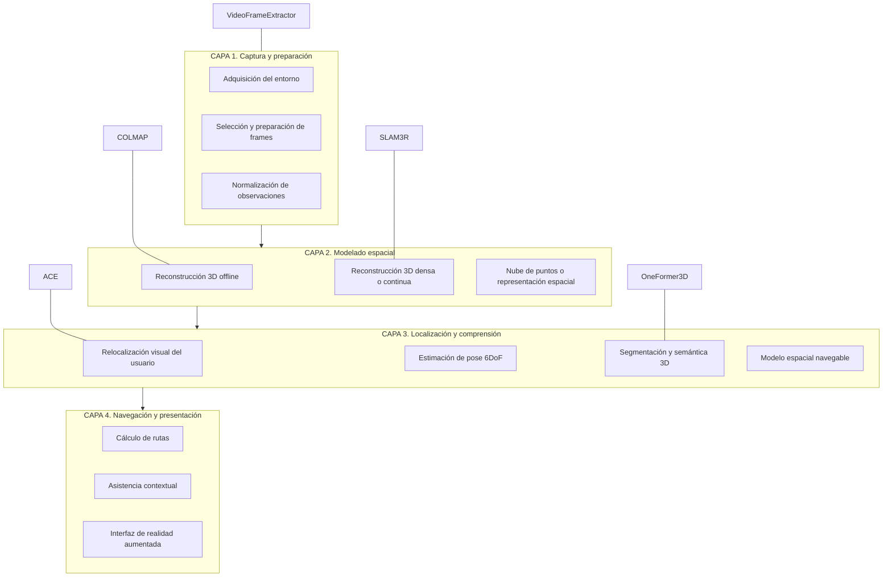

# Diagrama de arquitectura de UniWhere

Este documento representa la arquitectura lógica de UniWhere en formato visual, con énfasis en etapas funcionales y relación entre modelos. El objetivo es describir cómo fluye la información dentro del sistema, no detallar implementación.

## Vista 1. Flujo lógico del sistema

## Interpretación de la vista de flujo

La secuencia lógica del sistema puede leerse así:

1. El campus se observa mediante video o imágenes.
2. Las observaciones se preparan para alimentar el pipeline visual.
3. Se construye un modelo geométrico 3D del entorno.
4. El usuario se relocaliza dentro de ese modelo.
5. El entorno se enriquece con significado semántico.
6. Se consolida un modelo espacial navegable.
7. Se calcula una guía hacia el destino.
8. La guía se presenta con AR.

## Vista 2. Arquitectura por capas

## Interpretación de la vista por capas

### Capa 1. Captura y preparación

Convierte el entorno físico en datos visuales utilizables. Aquí el sistema todavía no navega ni localiza; solo prepara la evidencia necesaria para que los modelos posteriores trabajen con consistencia.

### Capa 2. Modelado espacial

Genera la representación tridimensional del campus. Esta capa construye la base geométrica que hace posible localizar al usuario y entender el entorno como espacio navegable.

### Capa 3. Localización y comprensión

Relaciona la observación actual del usuario con el modelo del entorno y agrega significado semántico al espacio. Esta es la capa donde la percepción se vuelve conocimiento operativo.

### Capa 4. Navegación y presentación

Transforma el conocimiento espacial en guía útil para el usuario. Es la capa que materializa la experiencia de navegación asistida en AR.

## Correspondencia con el repositorio

La estructura actual del repositorio se puede leer de forma consistente con estas capas:

- preprocesamiento concentra sobre todo las capas 1 y 2, y parte de la 3;
- backend debería consolidar la lógica operativa de localización, seguimiento y navegación;
- client representa la futura experiencia de usuario;
- docs conserva la documentación conceptual, académica y arquitectónica.

## Uso recomendado del diagrama

Este documento sirve como base para:

- explicar el proyecto en presentaciones,
- documentar el sistema en términos arquitectónicos,
- alinear el desarrollo con el entregable 1,
- y separar claramente la lógica del sistema de los detalles de implementación.